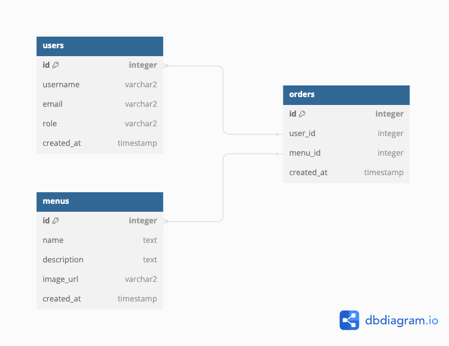

## Clone into local

- navigate to desired directory of your machine and open terimal
- make sure you have `git` installed on your local machine
- run `git clone https://github.com/PriyaPeo/office-lunch-management.git`
- run `cd office-lunch-management`
- open this project with vs code by `code .`

## Create database

- install PostgreSQL in your machine
- connect postgres as root user `psql -d postgres`
- create new database `CREATE DATABASE lunch_management;`
- create new user `CREATE USER youruser WITH ENCRYPTED PASSWORD 'yourpass';`
- grant all previlege `GRANT ALL PRIVILEGES ON DATABASE yourdbname TO youruser;`
- add role `ALTER ROLE username WITH CREATEDB;`
- connect postgres db with super user and run `ALTER DATABASE lunch_management OWNER TO youruser;`
- connect database with `psql` command `psql -d lunch_management -U youruser`

## Start backend

- navigate to `server` directory from project root directory
- run `npm install`
- create `.env` and set environment variables as like `.env.example`
- start backend dev server with `npm run dev`

## Database schema

## Database migration

- open new terminal and naivate to `server` directory
- run `npm run migrate:up` to create databse tables
- run `npm run migrate:down` to drop databse tables

## Start frontend

- navigate to `client` directory
- run `npm install` to install all the dependencies
- run `npm run dev` to start dev server

## Improvement areas

- codebase could be more organized to achieve better maintainability
- in client side, I didn't consider responsive design and ui is not 100% perfect. I mainly focused on functionality.
- simple authentication mechanism is applied for login, but I didn't implement any authorization on apis
- no form validation is added on client side
